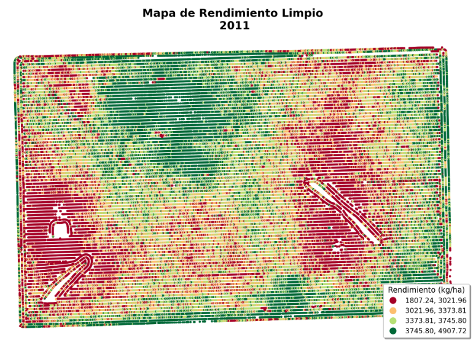
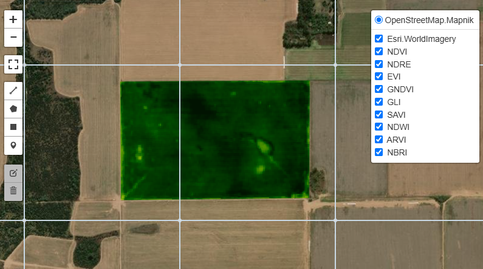
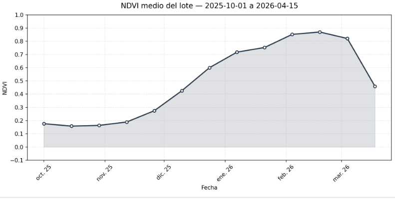

```{=html}
<style>

/* ── Tipografía ─────────────────────────────────────────── */
@import url('https://fonts.googleapis.com/css2?family=Space+Grotesk:wght@400;500;600;700&family=Libre+Baskerville:ital,wght@0,400;0,700;1,400&display=swap');

/* ── Tokens ─────────────────────────────────────────────── */
:root {
  --dark:    #1B2632;
  --teal:    #1f5e63;
  --sage:    #8faf9a;
  --amber:   #ffb162;
  --surface: #f7f5f0;
  --text:    #1a1a1a;
  --muted:   #5a5a5a;
  --radius:  10px;
  --shadow:  0 4px 24px rgba(27,38,50,0.10);
}

/* ── Perfil hero ─────────────────────────────────────────── */
.quarto-about-trestles .about-entity {
  border-right: 3px solid var(--amber);
  padding-right: 2rem;
}

.quarto-about-trestles h1.title {
  font-family: 'Space Grotesk', sans-serif;
  font-size: 2.1rem;
  font-weight: 700;
  color: var(--dark);
  letter-spacing: -0.02em;
  margin-bottom: 0.15rem;
}

.quarto-about-trestles .subtitle {
  font-family: 'Space Grotesk', sans-serif;
  font-size: 0.95rem;
  color: var(--teal);
  font-weight: 500;
  letter-spacing: 0.03em;
  text-transform: uppercase;
  margin-bottom: 1.2rem;
}

.about-links .about-link {
  font-family: 'Space Grotesk', sans-serif;
  font-size: 0.85rem;
  font-weight: 600;
  color: var(--dark) !important;
  border: 1.5px solid var(--dark);
  border-radius: 4px;
  padding: 5px 14px;
  text-decoration: none !important;
  transition: background 0.2s, color 0.2s;
  margin-right: 6px;
  margin-bottom: 6px;
  display: inline-flex;
  align-items: center;
  gap: 6px;
}

.about-links .about-link:hover {
  background: var(--dark);
  color: var(--amber) !important;
}

/* ── Secciones de texto ──────────────────────────────────── */
.quarto-about-trestles .about-contents h2 {
  font-family: 'Space Grotesk', sans-serif;
  font-size: 0.78rem;
  font-weight: 700;
  letter-spacing: 0.12em;
  text-transform: uppercase;
  color: var(--teal);
  border-bottom: 2px solid var(--amber);
  padding-bottom: 4px;
  margin-top: 2rem;
  margin-bottom: 0.9rem;
  display: inline-block;
}

.quarto-about-trestles .about-contents p {
  font-family: 'Libre Baskerville', serif;
  font-size: 0.97rem;
  line-height: 1.78;
  color: var(--text);
}

/* ── Badges de herramientas ──────────────────────────────── */
.quarto-about-trestles .about-contents p code,
.tool-badge {
  font-family: 'Space Grotesk', sans-serif;
  font-size: 0.78rem;
  font-weight: 600;
  background: var(--dark);
  color: var(--amber);
  border-radius: 4px;
  padding: 3px 9px;
  letter-spacing: 0.03em;
  border: none;
  display: inline-block;
  margin: 2px 3px;
}

/* ── Sección Proyectos ───────────────────────────────────── */
.proyectos-header {
  font-family: 'Space Grotesk', sans-serif;
  font-size: 0.78rem;
  font-weight: 700;
  letter-spacing: 0.12em;
  text-transform: uppercase;
  color: var(--teal);
  border-bottom: 2px solid var(--amber);
  padding-bottom: 4px;
  margin-top: 3rem;
  margin-bottom: 0.4rem;
  display: inline-block;
}

.proyectos-intro {
  font-family: 'Libre Baskerville', serif;
  font-size: 0.95rem;
  color: var(--muted);
  margin-bottom: 2rem;
  line-height: 1.7;
}

/* ── Tarjetas de proyecto ────────────────────────────────── */
.project-card {
  background: #ffffff;
  border: 1px solid #e8e4de;
  border-radius: var(--radius);
  overflow: hidden;
  transition: transform 0.22s ease, box-shadow 0.22s ease;
  box-shadow: var(--shadow);
  display: flex;
  flex-direction: column;
  height: 100%;
}

.project-card:hover {
  transform: translateY(-5px);
  box-shadow: 0 12px 36px rgba(27,38,50,0.16);
}

.project-card a.card-img-link {
  display: block;
  overflow: hidden;
  aspect-ratio: 16/9;
  background: var(--surface);
}

.project-card img {
  width: 100%;
  height: 100%;
  object-fit: cover;
  transition: transform 0.35s ease;
  display: block;
}

.project-card:hover img {
  transform: scale(1.04);
}

.card-body {
  padding: 1.1rem 1.25rem 1.25rem;
  display: flex;
  flex-direction: column;
  flex: 1;
}

.card-category {
  font-family: 'Space Grotesk', sans-serif;
  font-size: 0.7rem;
  font-weight: 700;
  letter-spacing: 0.1em;
  text-transform: uppercase;
  margin-bottom: 0.4rem;
}

.cat-r     { color: #2166ac; }
.cat-python { color: #1f5e63; }
.cat-gee   { color: #b35900; }
.cat-stats { color: #6a3d9a; }

.card-title {
  font-family: 'Space Grotesk', sans-serif;
  font-size: 1rem;
  font-weight: 700;
  color: var(--dark);
  margin-bottom: 0.5rem;
  line-height: 1.3;
  text-decoration: none !important;
}

.card-title:hover {
  color: var(--teal);
}

.card-desc {
  font-family: 'Libre Baskerville', serif;
  font-size: 0.84rem;
  color: var(--muted);
  line-height: 1.65;
  flex: 1;
  margin-bottom: 0.9rem;
}

.card-tags {
  display: flex;
  flex-wrap: wrap;
  gap: 5px;
  margin-top: auto;
}

.tag {
  font-family: 'Space Grotesk', sans-serif;
  font-size: 0.7rem;
  font-weight: 600;
  padding: 2px 8px;
  border-radius: 3px;
  letter-spacing: 0.02em;
}

.tag-r      { background: #dbeafe; color: #1e40af; }
.tag-py     { background: #d1fae5; color: #065f46; }
.tag-gee    { background: #fef3c7; color: #92400e; }
.tag-geo    { background: #ede9fe; color: #5b21b6; }
.tag-stat   { background: #fce7f3; color: #9d174d; }
.tag-agro   { background: #ecfdf5; color: #14532d; }

/* ── Grid de proyectos ───────────────────────────────────── */
.projects-grid {
  display: grid;
  grid-template-columns: repeat(auto-fill, minmax(300px, 1fr));
  gap: 1.4rem;
  margin-top: 0.5rem;
}

/* ── Footer de página ────────────────────────────────────── */
.nav-footer {
  font-family: 'Space Grotesk', sans-serif;
  font-size: 0.82rem;
}

/* ── Responsive ──────────────────────────────────────────── */
@media (max-width: 768px) {
  .projects-grid {
    grid-template-columns: 1fr;
  }
  .quarto-about-trestles .about-entity {
    border-right: none;
    border-bottom: 3px solid var(--amber);
    padding-right: 0;
    padding-bottom: 1.5rem;
    margin-bottom: 1.5rem;
  }
}
</style>
```

## Sobre mí

Ingeniero Agrónomo con conocimientos e interés en agricultura de precisión, análisis y ciencia de datos aplicada al agro. Trabajo con **R**, **Python** y **Google Earth Engine** para abordar problemas reales: desde la limpieza de mapas de rendimiento hasta el monitoreo satelital de cultivos con series temporales.


## Herramientas

`R` · `Python` · `Google Earth Engine` · `Quarto` · `QGIS` · `Git` · `SQL`

## Proyectos

```{=html}
<div class="projects-grid">

  <!-- 1. Mapa de rendimiento R -->
  <div class="project-card">
    <a class="card-img-link" href="proyectos/mapa-rendimiento/mapa-rendimiento.html">
      
    </a>
    <div class="card-body">
      <span class="card-category cat-r">R · Agricultura de Precisión</span>
      <a class="card-title" href="proyectos/mapa-rendimiento/mapa-rendimiento.html">
        Limpieza de mapa de rendimiento con R
      </a>
      <p class="card-desc">
        Detección y eliminación de datos atípicos espaciales en mapas de 
        rendimiento. Análisis exploratorio, filtros estadísticos y 
        visualización cartográfica final.
      </p>
      <div class="card-tags">
        <span class="tag tag-r">R</span>
        <span class="tag tag-geo">sf</span>
        <span class="tag tag-r">ggplot2</span>
        <span class="tag tag-agro">Ag. Precisión</span>
      </div>
    </div>
  </div>

  <!-- 2. Mapa de rendimiento Python -->
  <div class="project-card">
    <a class="card-img-link" href="proyectos/mapa-rendimiento-py/mapa-rendimiento-py.html">
      
    </a>
    <div class="card-body">
      <span class="card-category cat-python">Python · Agricultura de Precisión</span>
      <a class="card-title" href="proyectos/mapa-rendimiento-py/mapa-rendimiento-py.html">
        Limpieza de mapa de rendimiento con Python
      </a>
      <p class="card-desc">
        Limpieza y análisis de mapas de rendimiento usando Python. 
        Filtros estadísticos, análisis exploratorio y visualización 
        con GeoPandas y matplotlib.
      </p>
      <div class="card-tags">
        <span class="tag tag-py">Python</span>
        <span class="tag tag-geo">GeoPandas</span>
        <span class="tag tag-py">matplotlib</span>
        <span class="tag tag-agro">Ag. Precisión</span>
      </div>
    </div>
  </div>

  <!-- 3. Geoestadística e interpolación -->
  <div class="project-card">
    <a class="card-img-link" href="proyectos/interpolacion-espacial/interpolacion-espacial.html">
      
    </a>
    <div class="card-body">
      <span class="card-category cat-r">R · Geoestadística</span>
      <a class="card-title" href="proyectos/interpolacion-espacial/interpolacion-espacial.html">
        Geoestadística e interpolación espacial
      </a>
      <p class="card-desc">
        Interpolación de variables de suelo con Kriging e IDW. Análisis 
        variográfico, validación cruzada y comparación de métodos sobre 
        datos VERIS en Córdoba.
      </p>
      <div class="card-tags">
        <span class="tag tag-r">R</span>
        <span class="tag tag-geo">gstat</span>
        <span class="tag tag-geo">Kriging</span>
        <span class="tag tag-geo">IDW</span>
      </div>
    </div>
  </div>

  <!-- 4. Zonificación -->
  <div class="project-card">
    <a class="card-img-link" href="proyectos/zonificacion/zonificacion.html">
      
    </a>
    <div class="card-body">
      <span class="card-category cat-r">R · Manejo por Ambientes</span>
      <a class="card-title" href="proyectos/zonificacion/zonificacion.html">
        Zonificación de ambientes
      </a>
      <p class="card-desc">
        Clasificación no supervisada para delimitación de zonas de manejo 
        sitio-específico. Integración de mapas de rendimiento, topografía 
        e índices de vegetación mediante MULTISPATI-PCA y Fuzzy K-Means.
      </p>
      <div class="card-tags">
        <span class="tag tag-r">R</span>
        <span class="tag tag-stat">MULTISPATI-PCA</span>
        <span class="tag tag-stat">K-Means</span>
        <span class="tag tag-agro">Ag. Precisión</span>
      </div>
    </div>
  </div>

  <!-- 5. Regresión espacial -->
  <div class="project-card">
    <a class="card-img-link" href="proyectos/regresion-espacial/regresion-espacial.html">
      
    </a>
    <div class="card-body">
      <span class="card-category cat-r">R · Análisis Económico</span>
      <a class="card-title" href="proyectos/regresion-espacial/regresion-espacial.html">
        Regresión espacial y optimización de densidad
      </a>
      <p class="card-desc">
        Densidad variable por zona de manejo en maíz: análisis espacial, 
        optimización de dosis y evaluación económica. Modelo SEM aplicado 
        a ensayos de fertilización con R.
      </p>
      <div class="card-tags">
        <span class="tag tag-r">R</span>
        <span class="tag tag-stat">Reg. Espacial</span>
        <span class="tag tag-stat">SEM</span>
        <span class="tag tag-agro">Ensayos</span>
      </div>
    </div>
  </div>

  <!-- 6. ANOVA -->
  <div class="project-card">
    <a class="card-img-link" href="proyectos/anova/anova.html">
      
    </a>
    <div class="card-body">
      <span class="card-category cat-stats">R · Estadística</span>
      <a class="card-title" href="proyectos/anova/anova.html">
        Análisis de la varianza (ANOVA)
      </a>
      <p class="card-desc">
        ANOVA factorial en diseño en bloques completos al azar (DBCA). 
        Diagnóstico de residuos, tamaños de efecto (η²) e interpretación 
        agronómica aplicada a ensayos de fertilización.
      </p>
      <div class="card-tags">
        <span class="tag tag-r">R</span>
        <span class="tag tag-stat">ANOVA</span>
        <span class="tag tag-stat">DBCA</span>
        <span class="tag tag-agro">Ensayos</span>
      </div>
    </div>
  </div>

  <!-- 7. Teledetección Python -->
  <div class="project-card">
    <a class="card-img-link" href="proyectos/teledeteccion-python/teledeteccion-python.html">
      
    </a>
    <div class="card-body">
      <span class="card-category cat-python">Python · Teledetección</span>
      <a class="card-title" href="proyectos/teledeteccion-python/teledeteccion-python.html">
        Teledetección con Python
      </a>
      <p class="card-desc">
        Procesamiento y análisis de imágenes satelitales Landsat 9 con 
        Python. Cálculo de índices de vegetación, análisis espectral 
        y visualización de resultados.
      </p>
      <div class="card-tags">
        <span class="tag tag-py">Python</span>
        <span class="tag tag-gee">Landsat 9</span>
        <span class="tag tag-agro">Índices espectrales</span>
      </div>
    </div>
  </div>

  <!-- 8. Teledetección GEE -->
  <div class="project-card">
    <a class="card-img-link" href="proyectos/teledeteccion-gee/teledeteccion-gee.html">
      
    </a>
    <div class="card-body">
      <span class="card-category cat-gee">Python · Google Earth Engine</span>
      <a class="card-title" href="proyectos/teledeteccion-gee/teledeteccion-gee.html">
        Teledetección con Google Earth Engine
      </a>
      <p class="card-desc">
        Procesamiento de imágenes Sentinel-2 y cálculo de nueve índices 
        espectrales sobre un lote agrícola mediante la API de Python de 
        GEE. Mapa interactivo con panel de capas.
      </p>
      <div class="card-tags">
        <span class="tag tag-py">Python</span>
        <span class="tag tag-gee">GEE</span>
        <span class="tag tag-gee">Sentinel-2</span>
        <span class="tag tag-agro">Índices espectrales</span>
      </div>
    </div>
  </div>

  <!-- 9. Serie temporal GEE -->
  <div class="project-card">
    <a class="card-img-link" href="proyectos/serie-temporal-gee/serie-temporal-gee.html">
      
    </a>
    <div class="card-body">
      <span class="card-category cat-gee">Python · Serie Temporal</span>
      <a class="card-title" href="proyectos/serie-temporal-gee/serie-temporal-gee.html">
        Seguimiento de cultivo con GEE
      </a>
      <p class="card-desc">
        Monitoreo satelital del ciclo completo de un cultivo con GEE. 
        Consulta a la nube, extracción de series temporales de índices 
        de vegetación y visualización de la dinámica fenológica.
      </p>
      <div class="card-tags">
        <span class="tag tag-py">Python</span>
        <span class="tag tag-gee">GEE</span>
        <span class="tag tag-gee">Serie Temporal</span>
        <span class="tag tag-agro">Fenología</span>
      </div>
    </div>
  </div>

  <!-- 10. NDVI_3D -->
  <div class="project-card">
    <a class="card-img-link" href="proyectos/ndvi-tres-dim/ndvi-tres-dim.html">
      
    </a>
    <div class="card-body">
      <span class="card-category cat-gee">Python · NDVI</span>
      <a class="card-title" href="proyectos/ndvi-tres-dim/ndvi-tres-dim.html">
        NDVI en 3D
      </a>
      <p class="card-desc">
        Monitoreo satelital del ciclo completo de un cultivo con GEE. 
        Consulta a la nube, extracción de series temporales de índices 
        de vegetación y visualización de la dinámica fenológica.
      </p>
      <div class="card-tags">
        <span class="tag tag-py">Python</span>
        <span class="tag tag-gee">GEE</span>
        <span class="tag tag-gee">Serie Temporal</span>
        <span class="tag tag-agro">Fenología</span>
      </div>
    </div>
  </div>

</div>


```
