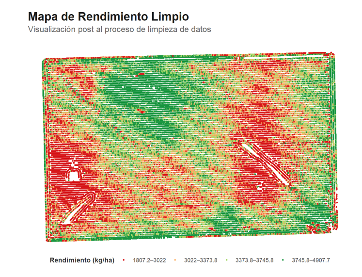
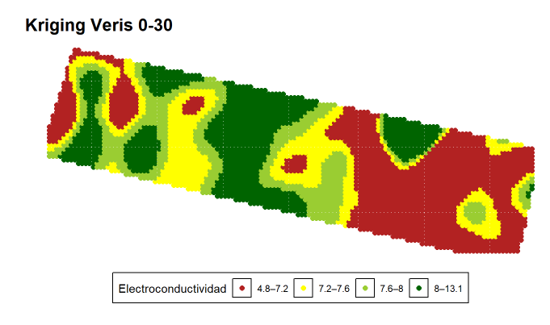
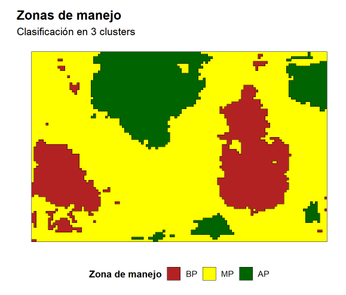
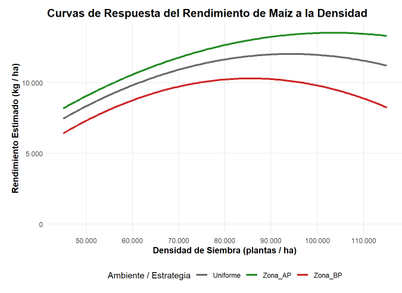
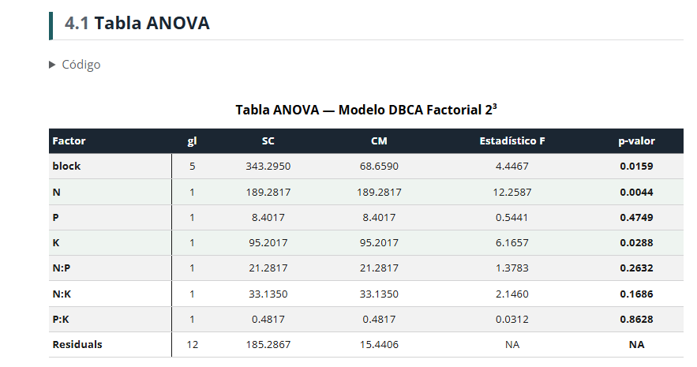
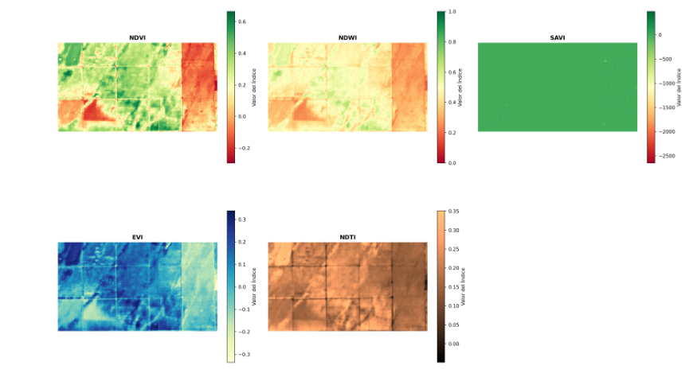

## Sobre mí

Ingeniero Agrónomo con sólida formación en el manejo integral de cultivos extensivos y suelos, complementado con especialización en agricultura de precisión, análisis y ciencia de datos. Cuento con dominio avanzado en SIG y Google Earth Engine para teledetección, integrando herramientas de programación y gestión de bases de datos (Python, R y SQL) aplicadas al agro. 

## Herramientas

`R` · `Python` · `Google Earth Engine` · `Quarto` · `QGIS` · `Git` · `SQL`

## Proyectos

::: {.grid}

::: {.g-col-12 .g-col-md-6}

### [Limpieza de mapa de rendimiento](proyectos/mapa-rendimiento/mapa-rendimiento.html)
Detección, eliminación y visualización de de datos atípicos espaciales en cosechadoras con R. Análisis exploratorio, filtros estadísticos y visualización final.

`R` · `sf` · `ggplot2` · `Agricultura de precisión`
:::

::: {.g-col-12 .g-col-md-6}

### [Geoestadística e Interpolación](proyectos/interpolacion-espacial/interpolacion-espacial.html)
Interpolación espacial de variables de suelo con Kriging e IDW. Análisis variográfico, validación cruzada y comparación de métodos sobre datos VERIS en Córdoba.

`R` · `gstat` · `Kriging` · `IDW`
:::

::: {.g-col-12 .g-col-md-6}

### [Zonificación](proyectos/zonificacion/zonificacion.html)
Clasificación no supervisada K-means para delimitación de zonas de manejo sitio-específico. Integración de mapa de rendimientos, topografía e índices de vegetación.

`R` · `MULTISPATI-PCA` · `K-means` · `Manejo por ambientes` · `Geoestadística`
:::

::: {.g-col-12 .g-col-md-6}

### [Análsis Regresión Espacial y Optimizacion](proyectos/regresion-espacial/regresion-espacial.html)
Densidad Variable por Zona de Manejo en Maíz: Análisis Espacial, Optimización y Evaluación Económica con R

`R` · `Regresión Espacial` · `Optimización` · `Análisis Económico` · `Ensayos`
:::

::: {.g-col-12 .g-col-md-6}

### [Análisis de la Varianza](proyectos/anova/anova.html)
Análisis de la Varianza de un set de datos nativo de R (npk) sobre la fertilización en Pisum sativum.

`R` · `ANOVA` · `Estadística` 
:::

::: {.g-col-12 .g-col-md-6}

### [Teledetección con Python](proyectos/teledeteccion-python/teledeteccion-python/teledeteccion-python.html)
Precesamiento y análisis de una imagen satelital proveniente del satélite Landsat 9 a través de Python

`Python` · `Teledetección` · `Indices de Vegetación` · `Landsat 9`
:::

:::

