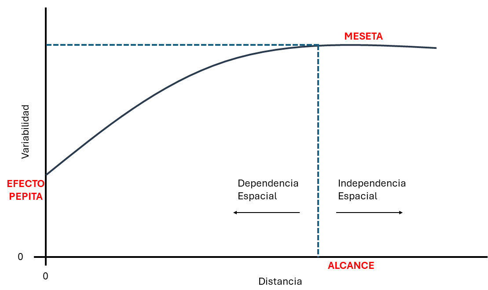

# Introducción {#sec-introduccion}

Este documento describe un flujo de trabajo para la **Interpolación Espacial**. El punto de partida es un archivo vectorial de puntos de la Conductividad Eléctrica Aparente (CEa) del suelo, obtenido con un sensor *VERIS* para dos profundidades (0–30 cm y 0–90 cm).

A partir de estos puntos, el flujo avanza en tres etapas principales:

-   Primero, se construye el **Semivariograma** empírico y se ajustan tres modelos teóricos (Esférico, Gaussiano y Exponencial). La selección del mejor modelo es a trevés de un criterio visual y el error residual (SSErr).

-   Segundo, con el modelo seleccionado se ejecuta la interpolación por **Kriging Ordinario**.

-   Como referencia comparativa, se aplica también una interpolación **IDW** (*Inverse Distance Weighting*).

# Librerias Necesarias

```{r}
library(readxl)   
library(tidyverse)  
library(gstat)
library(sp)
library(sf)
library(terra)
library(tidyterra)
library(DT)
library(knitr)
library(kableExtra)
library(patchwork)

options(scipen = 999)
```

Tanto `gstat` como `geoR` son librerías de R diseñadas para el análisis geoestadístico, especialmente para:

-   Construir semivariogramas empíricos y teóricos
-   Ajustar modelos de variograma
-   Realizar interpolación mediante Kriging

Las diferencias entre ellas son:

::::: metodo-comparativo
::: {.metodo-item .metodo-kriging}
**GSTAT**

Es la más usada actualmente para análisis geoestadístico aplicado a datos espaciales en R. Muy bien integrada con los flujos modernos (sf, raster, terra). Modelos disponibles: Esférico, Exponencial, Gaussiano, Lineal, Matérn, etc.

Ventajas:

-   Muy rápido y fácil de usar.
-   Perfecta integración con sf y terra (mapas modernos).
-   Ideal para análisis exploratorio y cartografía.
-   Muy visual (plot del semivariograma, kriging maps).

Limitaciones:

-   Menor control sobre la parte probabilística del modelo.
-   No calcula intervalos de confianza del semivariograma de forma nativa.
-   Menor detalle estadístico que geoR.
:::

::: {.metodo-item .metodo-idw}
**GEOR**

Tiene un enfoque más estadístico y probabilístico. Permite trabajar tanto con modelos clásicos como con inferencia bayesiana. Muy utilizado en investigación académica y análisis profundo de estructuras espaciales.

Extras avanzados:

-   Cálculo de intervalos de confianza del semivariograma.
-   Modelos bayesianos (krige.bayes).
-   Control detallado de la covarianza y anisotropía.
-   Permite simulaciones geoestadísticas.

Ventajas:

-   Mucho más flexible y profundo en el aspecto estadístico.
-   Ideal para estudios académicos o de investigación avanzada.
-   Permite hacer inferencia sobre los parámetros del variograma.

Limitaciones:

-   Menos integración con sf o sp.
-   Menos amigable para visualizaciones o flujos modernos.
-   Código más largo y menos intuitivo.
:::
:::::

# Carga de datos

Para leer datos se usó la función `st_read()` del paquete `sf`. Esta función devuelve un objeto clase `Simple Feature (sf)`

> Un objeto `sf` es, esencialmente, un `data.frame` (estructura de datos más común de R) que tiene una columna especial llamada `geometry`, la cual almacena la representación espacial (puntos, líneas o polígonos) que corresponde a cada fila. Todas las librerías usadas en este documento son compatible con esta estructura de datos, por lo que no es necesario modificarla.

```{r warning=FALSE}
veris <- st_read("data/Veris_EC_20S.shp", quiet = TRUE) 
```

# Exploración de datos

## Resumen

Se visualizan las primeras 5 filas de set de datos usando la librería `kableExtra`.

```{r}
#| code-fold: true
#| code-summary: "Código"

primeras_filas <- veris %>%
  head(5) 


primeras_filas %>%
  kable(
    format = "html",
    align = "c" 
  ) %>%
  kable_classic(
    full_width = TRUE, 
    font_size = 13
  ) %>%
  kable_styling(
    bootstrap_options = c("striped", "hover", "condensed")
  ) %>%
  row_spec(0, bold = TRUE, color = "black", extra_css = "border-bottom: 2px solid black;") %>%
  row_spec(nrow(primeras_filas), extra_css = "border-bottom: 2px solid black;")
```

## Clase del Objeto

```{r}
class(veris)
```

## CRS

Se comprueba el Sistema de Referencia de Coordenadas (CRS) del objeto a través de `st_crs()`.

```{r}
st_crs(veris)
```

# Visualizar

La visualización se estructuró mediante una discretización en cuantiles (4), para ello, primero se deben crear estos cuantiles.

## Cuantiles

```{r}
veris <- veris %>% 
  mutate( 
    CE_q = cut( 
      Veris_0_30,
      breaks = quantile(Veris_0_30, probs = seq(0, 1, 0.25), na.rm = TRUE), 
      include.lowest = TRUE 
)) 

veris <- veris %>% 
  mutate( 
    CE_q_2 = cut( 
      Veris_0_90, 
      breaks = quantile(Veris_0_90, probs = seq(0, 1, 0.25), na.rm = TRUE), 
      include.lowest = TRUE 
)) 
```

## Graficar

Se generan dos gráficos: en la pestaña 1 para la profundidad 0-30 cm y en la pestaña 2 para la profundidad 0-90 cm:

::: {.panel-tabset .tabset-topline}
## 0-30 cm

```{r}
#| code-fold: true
#| code-summary: "Código"

ggplot(veris) + 
  geom_sf(aes(color = CE_q), size = 2) + 
  scale_color_brewer(palette = "RdYlGn", direction = 1) + 
  labs(
    title = "Electroconductividad del suelo (0–30 cm)",
    color = "CE (µS/cm)"
  ) +
  coord_sf(datum = 32720) +
  theme_minimal() +
  theme(
    plot.title = element_text(size = 16, face = "bold"),
    axis.title = element_blank(),
    axis.text = element_blank(),
    axis.ticks = element_blank(),
    panel.grid = element_blank(),
    legend.position = "bottom",  
    legend.box.background = element_rect(fill = "snow", colour = "black") 
  )
```

## 0-90 cm

```{r}
#| code-fold: true
#| code-summary: "Código"

ggplot(veris) + 
  geom_sf(aes(color = CE_q_2), size = 2) + 
  scale_color_brewer(palette = "RdYlGn", direction = 1) + 
  labs(
    title = "Electroconductividad del suelo (0–90 cm)",
    color = "CE (µS/cm)"
  ) +
  coord_sf(datum = 32720) +
  theme_minimal() +
  theme(
    plot.title = element_text(size = 16, face = "bold"),
    axis.title = element_blank(),
    axis.text = element_blank(),
    axis.ticks = element_blank(),
    panel.grid = element_blank(),
    legend.position = "bottom",  
    legend.box.background = element_rect(fill = "snow", colour = "black") 
  )
```
:::

# Estimación Empírica del Semivariograma {#sec-semiv}

El **Semivariograma** es una herramienta fundamental en la geoestadística, permite analizar el comportamiento espacial de una variable sobre un área definida y la influencia que cada uno de los resgitros tiene sobre sus vecinos.

Se identifican tres parámetros claves que definen el modelo espacial (@fig-semivariograma):

-   **I. Efecto Pepita (Nugget)**

Representa la variabilidad a distancias muy cortas (incluso cuando la distancia entre puntos es cero). Es una forma estadística de medir la varianza en el origen.

Nugget grande: Gran variabilidad en pequeñas escalas espaciales → baja estructuración de datos

Nugget cercano a cero: Fuerte estructura espacial

-   **II. Meseta (Sill)**

Es el valor máximo de variabilidad que alcanza el semivariograma. Representa la varianza total de la variable en el área de estudio.

-   **III. Alcance (Range)**

Es la distancia a partir de la cual se alcanza la meseta. Define el rango de influencia espacial: más allá de esta distancia, los puntos ya no están correlacionados espacialmente.

{#fig-semivariograma width="80%" fig-align="center"}

## Generar Semivariograma

Se usó la función `variogram()` del paquete `gstat`.

```{r}
vemp <- variogram(Veris_0_30 ~ 1, veris) 
```

## Visualizar

Se utilizó la función `plot` para visualizarlo.

```{r}
plot(vemp) 
```

# Ajuste del Semivariograma {#sec-ajust}

**¿Qué significa “ajustar un modelo”?**

El semivariograma empírico muestra la relación espacial observada en los datos, pero al estar compuesto por puntos experimentales puede resultar irregular. Por esta razón, se ajusta una curva teórica que resume y representa esa tendencia general. De esta manera, se obtiene un modelo matemático continuo que describe cómo varía la CEa en el espacio y que puede ser utilizado por el método de Kriging para estimar valores en ubicaciones no muestreadas.

En la Geoestadística, el ajuste automático asegura que el modelo sea insesgado y óptimo (MELI).

El ajuste se realizó mediante el algoritmo de Mínimos Cuadrados Ponderados (utilizando la función `fit.variogram` de `gstat`), el cual busca minimizar la desviación entre los puntos observados y la curva teórica. Se evaluaron tres modelos fundamentales por su relevancia en estudios agronómicos:

-   Modelo Esférico
-   Modelo Exponencial
-   Modelo Gaussiano

A través del ajuste automático, se determinaron los tres parámetros claves del semivariograma, que definen la morfología de la variabilidad (@fig-semivariograma):

-   Efecto Pepita
-   Meseta
-   Alcance

::: {.panel-tabset .tabset-topline}
## Modelo Esférico

```{r}
modsph2 <- fit.variogram(vemp, vgm(model = "Sph", nugget = TRUE)) 

```

## Modelo Gaussiano

```{r}
modgau2 <- fit.variogram(vemp, vgm(model = "Gau", nugget = TRUE)) 
```

## Modelo Exponencial

```{r}
modexp2 <- fit.variogram(vemp, vgm(model = "Exp", nugget = TRUE)) 
```
:::

# Comparar Modelos

La elección del modelo que mejor representa la variabilidad espacial de la Conductividad Eléctrica Aparente (CEa) se fundamentó en un análisis de doble criterio: **cualitativo (visual)** y **cuantitativo (estadístico)**.

## Comparación Visual

::: {.panel-tabset .tabset-topline}
## Esférico

```{r}
plot(vemp, modsph2) 

```

## Gaussiano

```{r}
plot(vemp, modgau2) 
```

## Exponencial

```{r}
plot(vemp, modexp2)
```
:::

A partir de esto, se podría inferir que, el **Modelo Gaussiano** es el que mejor representa la variabilidad espacial de la CEa.

## Comparación Cuantitativa

Se realiza a través del error residual (SSErr). Cuanto menor sea el SSErr, mejor se ajusta el modelo a los datos empíricos. Si el SSErr es grande, significa que la curva del modelo no "sigue" bien los puntos del variograma empírico.

El SSErr de cada modelo fue:

:::::::::::: premium-metrics-grid
::::: premium-metric
::: metric-name
Esférico
:::

::: {.metric-number .metric-highlight}
`r attr(modsph2, "SSErr")`
:::
:::::

::::: premium-metric
::: metric-name
Gaussiano
:::

::: {.metric-number .metric-highlight}
`r attr(modgau2, "SSErr")`
:::
:::::

::::: premium-metric
::: metric-name
Esférico
:::

::: {.metric-number .metric-highlight}
`r attr(modexp2, "SSErr")`
:::
:::::
::::::::::::

```{r message=FALSE, warning=FALSE, include=FALSE}
nugget <- modgau2$psill[modgau2$model == "Nug"]
sill   <- modgau2$psill[modgau2$model == "Gau"] + nugget  
range  <- modgau2$range[modgau2$model == "Gau"]
```

Se confirma que el modelo que mejor se ajustó es el **Gaussiano**. El cual tuvo los siguientes parámetros:

:::::::::::: premium-metrics-grid
::::: premium-metric
::: metric-name
Nugget
:::

::: {.metric-number .metric-highlight}
`r round(nugget, 3)`
:::
:::::

::::: premium-metric
::: metric-name
Sill
:::

::: {.metric-number .metric-highlight}
`r round(sill, 3)`
:::
:::::

::::: premium-metric
::: metric-name
Range
:::

::: {.metric-number .metric-highlight}
`r round(range, 2)`
:::
:::::
::::::::::::

# Interpolación Kriging {#sec-krig}

El Kriging es un método geoestadístico considerado MELI (*Mejor Estimador Lineal Insesgado*) o ELIO (*Estimador Lineal Insesgado Óptimo*), caracterizado por:

-   Linealidad: Las estimaciones son combinaciones lineales ponderadas de los datos existentes
-   Insesgamiento: La media de los errores de estimación es nula
-   Óptimo: Los errores de estimación tienen varianza mínima

La interpolación espacial se ejecutó mediante el algoritmo de Kriging Ordinario, utilizando la función `krige()` del paquete `gstat`. Esta función permite predecir valores en ubicaciones donde no se tomaron muestras, usando el modelo de variograma ajustado (@sec-ajust) y la información espacial de los puntos conocidos.

Para ejecutar la interpolación mediante la función `krige()`, el flujo de trabajo requiere convertir los objetos de la clase `sf` a la clase `sp`. Esta conversión es por cuestiones de compatibilidad: el paquete `gstat` fue desarrollado sobre la arquitectura del paquete `sp`.

El algoritmo de Kriging requiere dos elementos espaciales: los puntos observados y una grilla vacía sobre la cual calculará las estimaciones. Para que `krige()` funcione correctamente tanto los puntos como la grilla deben estar en clases espaciales compatibles del paquete `sp`.

## Realizar el Kriging

En primer lugar, se convierte el objeto `sf` a `sp`:

```{r}
veris_sp <- as(veris, "Spatial") 
```

Luego se crea una grilla:

```{r}
grilla <- expand.grid( 
  x = seq(min(veris_sp@coords[,1]), max(veris_sp@coords[,1]), by = 10), 
  y = seq(min(veris_sp@coords[,2]), max(veris_sp@coords[,2]), by = 10)) 
```

Se convierte la grilla a objeto espacial:

```{r}
coordinates(grilla) <- ~x+y 
```

Se le asigna el mismo CRS que el del objeto `veris_sp`:

```{r}
proj4string(grilla) <- proj4string(veris_sp) 
```

Realizar el Kriging:

```{r}
krig_res <- krige(Veris_0_30 ~ 1, veris_sp, grilla, model = modgau2) 
```

El objeto resultante (`krig_res`) no constituye una superficie continua en primera instancia, sino que consiste en una cantidad enorme de puntos espaciados de forma muy densa, cuyos centroides corresponden exactamente a los nodos de la grilla. Para cada nodo espacial coordenado $(X,Y)$, el objeto `krig_res` calcula y almacena internamente dos atributos fundamentales:

-   Predicción del Atributo (`var1.pred`): Es el valor estimado de la variable para ese punto del lote.

-   Varianza del Kriging (`var1.var`): Es una medida cuantitativa del error cuadrático medio de la predicción en cada punto.

# Graficar

Para graficar los resultados se llevaron a cabo dos alternativas:

-   Alternativa A: **Representación Vectorial**, convirtiendo el resultado del Kriging a objeto `sf`.
-   Alternativa B: **Representación Matricial Continua**: convirtiendo el resultado a `SpatRaster`.

## Alternativa A

Una vez obtenidos los resultados de la interpolación espacial mediante el algoritmo de Kriging Ordinario (@sec-krig), el resultado se estructuró en formato vectorial como un objeto de la clase `sf`:

```{r}
krig_sf <- st_as_sf(krig_res) 
```

Se ejecutó un recorte mediante una intersección vectorial (`st_intersection()`) utilizando el polígono del límite del lote como máscara:

```{r}
lote <- st_read("data/Lote.shp", quiet = TRUE) 

krig_sf_cortado<- st_intersection(krig_sf, lote) 
```

Se crearon los cuantiles, la variable continua de predicción (`var1.pred`) se transformó en una variable categórica ordinal de cuatro clases (`var1_q`):

```{r}
breaks <- quantile(krig_sf$var1.pred, probs = seq(0, 1, 0.25), na.rm = TRUE) 
 
krig_sf_cortado <- krig_sf_cortado %>% 
  mutate( 
    var1_q = cut(var1.pred, breaks = breaks, include.lowest = TRUE, 
                 labels = paste0(round(breaks[-5],1), "–", round(breaks[-1],1))) 
  ) 
```

Graficar:

```{r}
ggplot(krig_sf_cortado) + 
  geom_sf(aes(color = var1_q), size = 2) + 
  scale_color_manual(
    values = c("firebrick", "yellow", "yellowgreen", "darkgreen"),
    name = "Electroconductividad"    
  ) +
  theme_minimal() +
  labs(
    title = "Kriging Veris 0-30"       
  ) +
  theme(
    plot.title = element_text(size = 16, face = "bold"),
    axis.title = element_blank(),
    axis.text = element_blank(),
    axis.ticks = element_blank(),
    panel.grid = element_blank(),
    legend.position = "bottom",  
    legend.background = element_rect(fill = "white", color = "black"),
    legend.key = element_rect(fill = "white", color = "black")
  )
```

## Alternativa B

En este opción se migró del modelo vectorial al modelo de datos ráster. Para ello, los puntos cortados se convirtieron a la clase `SpatRaster`.

> `SpatRaster` es la clase central del paquete `terra`. Este paquete está diseñado para manejar datos **ráster** de forma eficiente. A diferencia de un objeto vectorial (`sf`), un ráster no guarda coordenadas individuales para cada dato. Un `SpatRaster` representa el espacio como una grilla regular de celdas (píxeles) dispuestas en filas y columnas. Este objeto almacena cuatro componentes: (a) matriz de datos (filas y columnas), (b) la extensión espacial (Bounding Box), (c) el CRS, (d) las capas (un solo objeto SpatRaster puede contener una o múltiples capas).

El flujo de trabajo fue el siguiente:

-   **Convertir a clase SpatRaster**:

Se procedió a la conversión de la capa vectorial recortada hacia la clase `SpatRaster` del paquete `terra`, mediante la función `vect()`:

```{r}
krig_vect_cortado <- vect(krig_sf_cortado) 
```

-   **Crear grilla**

Se creó un objeto ráster vacío (`rast()`) derivado de la extensión geográfica del lote. Se definió una resolución espacial de 10 metros (10 x 10 m por celda):

```{r}
r_base <- rast(krig_vect_cortado, res = 10)
```

-   **Rasterizar**

Finalmente, se transfirieron los valores predichos de rendimiento desde los puntos vectoriales hacia la grilla base regular. El algoritmo asignó a cada celda el valor del atributo del vector que cae dentro de sus límites geométricos.

```{r}
krig_raster <- rasterize(krig_vect_cortado, r_base, field = "var1_q") 
```

-   **Graficar**:

```{r}
ggplot() + 
  geom_spatraster(data = krig_raster, aes(fill = var1_q)) + 
  scale_fill_manual( 
    values = c("firebrick", "yellow", "yellowgreen", "darkgreen"), na.value = NA, name = "Electroconductividad") + 
  theme_minimal() +
  labs(
    title = "Kriging Veris 0-30") +
   theme(
    plot.title = element_text(size = 16, face = "bold"),
    axis.title = element_blank(),
    axis.text = element_blank(),
    axis.ticks = element_blank(),
    panel.grid = element_blank(),
    legend.position = "bottom",  
    legend.background = element_rect(fill = "white", color = "black"),
    legend.key = element_rect(fill = "white", color = "black")
  )
```

# Interpolación IDW

Es una técnica de interpolación clásica donde la influencia de cada punto disminuye proporcionalmente con la distancia.

Limitaciones principales:

-   No considera la estructura espacial
-   Ignora la configuración de puntos
-   Genera cambios abruptos
-   Requiere alta densidad de datos
-   Localmente sensible

A pesar de sus limitaciones, el IDW sigue siendo una referencia útil para comparaciones.

Para realizar la interpolación se usó la función `idw()` de `gstat`:

```{r}
idw = idw(Veris_0_30 ~ 1, veris_sp, grilla) 
```

El objeto resultante de esta operación (`idw`) comparte exactamente la misma estructura que el resultado del Kriging. Sin embargo, el contenido de su tabla de atributos presenta diferencias:

-   `var1.pred`: Almacena el valor estimado de conductividad eléctrica mediante un promedio ponderado.

-   Ausencia de Varianza (`var1.var = NA`): Un rasgo fundamental es que la columna destinada a registrar la varianza de la predicción carece por completo de datos numéricos, devolviendo valores nulos (NA). Al tratarse de un método estrictamente geométrico y no de un modelo estocástico, el IDW no posee un marco probabilístico. En consecuencia, el objeto es incapaz de cuantificar la incertidumbre predictiva o de proveer un mapa de error que permita evaluar la confiabilidad de las estimaciones a lo largo del lote.

# Graficar

Para graficar se usaron las dos alternativas descriptas para el Kriging Ordinario:

## Alternativa A

Convertir a objeto `sf`:

```{r}
idw_sf <- st_as_sf(idw) 
```

Seleccionar los puntos que estén dentro del lote:

```{r}
idw_sf_cortado<- st_intersection(idw_sf, lote) 
```

Crear los cuantiles:

```{r}
breaks <- quantile(idw_sf_cortado$var1.pred, probs = seq(0, 1, 0.25), na.rm = TRUE) 
 
idw_sf_cortado <- idw_sf_cortado %>% 
  mutate( 
    var1_q = cut(var1.pred, breaks = breaks, include.lowest = TRUE, 
                  labels = paste0(round(breaks[-5],1), "–", round(breaks[-1],1))) 
  ) 
```

Graficar:

```{r}
ggplot(idw_sf_cortado) + 
  geom_sf(aes(color = var1_q), size = 2) + 
  scale_color_manual( 
    values = c("firebrick", "yellow", "yellowgreen", "darkgreen"), name = "Electroconductividad") + 
  theme_minimal() +
  labs(
    title = "Interpolación IDW - Capa: Veris 0-30") +
   theme(
    plot.title = element_text(size = 16, face = "bold"),
    axis.title = element_blank(),
    axis.text = element_blank(),
    axis.ticks = element_blank(),
    panel.grid = element_blank(),
    legend.position = "bottom",  
    legend.background = element_rect(fill = "white", color = "black"),
    legend.key = element_rect(fill = "white", color = "black")
  )
```

## Alternativa B

Convertir el objeto sf a `SpatVector`:

```{r}
idw_vect_cortado <- vect(idw_sf_cortado) 
```

Crear una grilla base:

```{r}
r_base <- rast(idw_vect_cortado, res = 10) 
```

Rasterizar usando la columna deseada:

```{r}
idw_raster <- rasterize(idw_vect_cortado, r_base, field = "var1_q") 
```

Graficar:

```{r}
ggplot() + 
  geom_spatraster(data = idw_raster, aes(fill = var1_q)) + 
  scale_fill_manual( 
    values = c("firebrick", "yellow", "yellowgreen", "darkgreen"), na.value = NA, name = "Electrocond.") + 
  theme_minimal() + 
   labs(
    title = "Kriging Veris 0-30") +
   theme(
    plot.title = element_text(size = 16, face = "bold"),
    axis.title = element_blank(),
    axis.text = element_blank(),
    axis.ticks = element_blank(),
    panel.grid = element_blank(),
    legend.position = "bottom",  
    legend.background = element_rect(fill = "white", color = "black"),
    legend.key = element_rect(fill = "white", color = "black")
  )
```
